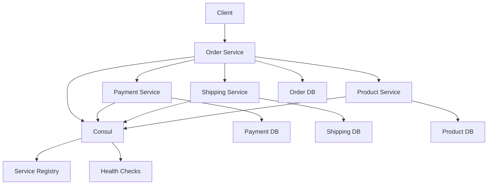

# 🚀 Microservices Architecture with Consul Service Registry


This repository contains a microservices-based application built using **Golang**, with each service having its own database, gRPC server, HTTP server, and connected via **Consul** for service discovery and registration.

---

## 🌟 Table of Contents

- [Overview](#overview)
- [Features](#features)
- [Architecture](#architecture)
- [Prerequisites](#prerequisites)
- [Getting Started](#getting-started)
- [Services](#services)
  - [Order Service](#order-service)
  - [Payment Service](#payment-service)
  - [Shipping Service](#shipping-service)
  - [Product Service](#product-service)
- [Running the Application](#running-the-application)
- [Contributing](#contributing)
- [License](#license)

---

## 📖 Overview

This project demonstrates a distributed system architecture where four microservices—**Order**, **Payment**, **Shipping**, and **Product**—are independently developed, deployed, and managed. Each service has its own database, gRPC server, and HTTP server. The services are registered with **Consul**, which acts as the service registry for service discovery and health checks.

---

## ✨ Features

- **Microservices Architecture**: Four independent services (Order, Payment, Shipping, Product).
- **Service Discovery**: Powered by **Consul**.
- **gRPC Support**: Efficient communication between services using gRPC.
- **HTTP Servers**: RESTful APIs for external clients.
- **Database Per Service**: Each service manages its own database.
- **Health Checks**: Automatic health checks for all services.
- **Scalability**: Designed to scale horizontally.

---

## 🏗️ Architecture

The architecture diagram below illustrates how the components interact:



---

### **Chunk 4: Prerequisites**
---

## 🛠️ Prerequisites

Before running the application, ensure you have the following installed:

- **Go**: Version 1.20 or higher
- **Docker**: For running databases and Consul
- **Make**: To simplify build and run commands
- **Protobuf Compiler**: For generating gRPC stubs

---

## 🚀 Getting Started

Follow these steps to set up and run the application locally:

1. **Clone the Repository**
   git clone https://github.com/yourusername/microservices-consul.git
   cd microservices-consul

---

### **Chunk 6: Services**
---

## 📦 Services

### 🛒 Order Service

- **Description**: Manages order creation, updates, and coordination with other services.
- **Endpoints**:
  - HTTP: `/orders`
  - gRPC: `CreateOrder`, `UpdateOrder`
- **Database**: PostgreSQL

### 💳 Payment Service

- **Description**: Handles payment processing and status updates.
- **Endpoints**:
  - HTTP: `/payments`
  - gRPC: `ProcessPayment`, `CheckPaymentStatus`
- **Database**: MySQL

### 🚚 Shipping Service

- **Description**: Manages shipping logistics and tracking.
- **Endpoints**:
  - HTTP: `/shipments`
  - gRPC: `CreateShipment`, `TrackShipment`
- **Database**: MongoDB

### 🛍️ Product Service

- **Description**: Provides product catalog and inventory management.
- **Endpoints**:
  - HTTP: `/products`
  - gRPC: `GetProduct`, `UpdateInventory`
- **Database**: SQLite

---

## 🎮 Running the Application

To run the entire application:

1. Start all services:
   ```bash
   make run
   ```
Access the services via their respective endpoints:
Order Service: http://localhost:8080/orders
Payment Service: http://localhost:8081/payments
Shipping Service: http://localhost:8082/shipments
Product Service: http://localhost:8083/products
Verify service registration in Consul:
Open http://localhost:8500 and check the "Services" tab.